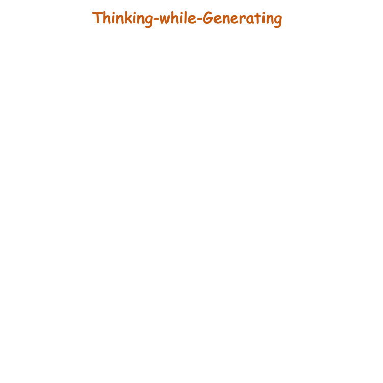
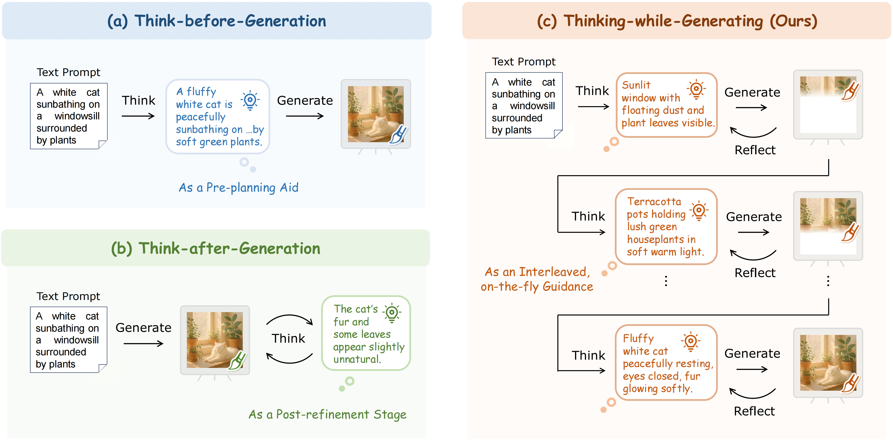
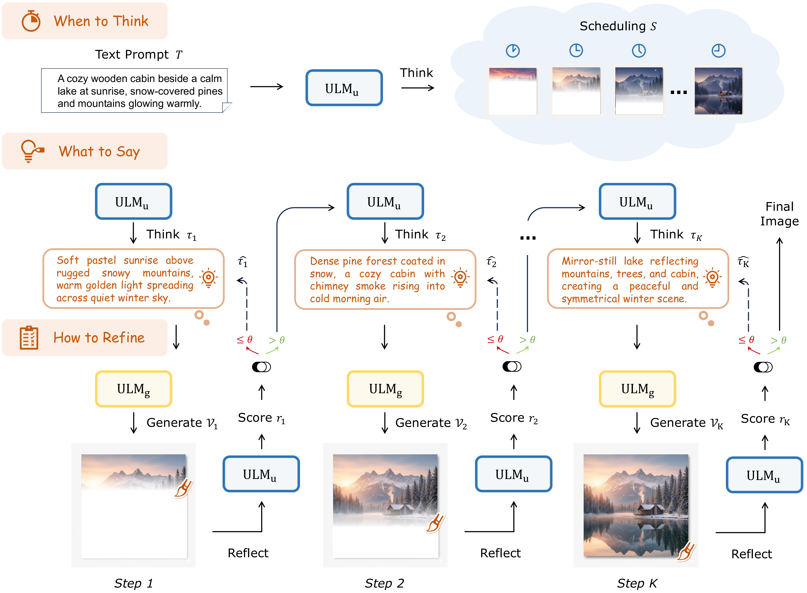
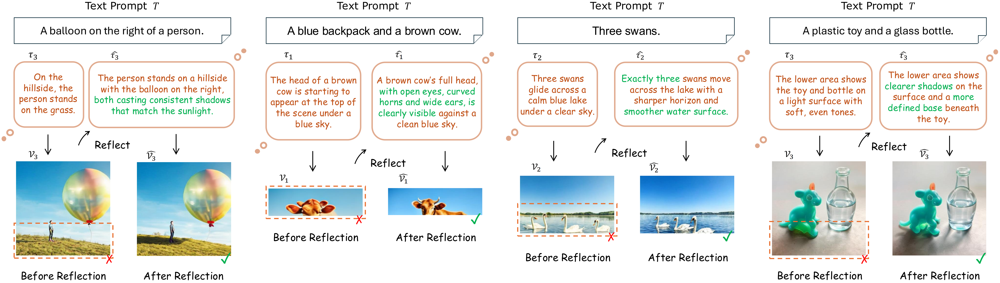

<h1 align="left">
  
  Thinking-while-Generating (TwiG) 
</h1>

Official repository for the paper "[Thinking-while-Generating: Interleaving Textual Reasoning throughout Visual Generation](https://arxiv.org/abs/2511.16671)".

[[🌍 Project Page](https://think-while-gen.github.io/)] [[📖 Paper](https://arxiv.org/abs/2511.16671)] [[🤗 TwiG-50K Dataset](https://github.com/ZiyuGuo99/Thinking-while-Generating)]

## 💥 News
- **[2025.11.20]** The paper **“Thinking-while-Generating”** is released on arXiv. 🚀


## 💭🎨 Thinking-while-Generating (TwiG)

Existing methods inject textual reasoning either **before** (pre-planning) or **after** (post-refinement) visual generation.  
**TwiG is the first framework to interleave textual reasoning *throughout* the entire visual synthesis process.**

> **We weave textual thoughts directly into the unfolding canvas**, providing on-the-fly semantic guidance and reflection during generation.

<p align="center">
  
</p>
<p align="center"><i>Interleaving textual reasoning throughout visual generation.</i></p>


### 📌 Where is textual reasoning applied?

<p align="center">
  
</p>


## 🚀 Framework

TwiG decouples generation into **Scheduling** (When to Think), **Reasoning** (What to Say), and **Reflection** (How to Refine).

<p align="center">
  
</p>


## 💪 Get Started
### Installation

Clone the repository:

   ```bash
   git clone https://github.com/ZiyuGuo99/Thinking-while-Generating.git
   cd Thinking-while-Generating
   ```

Create a conda environment:

   ```bash
   conda create -n twig python=3.11
   conda activate twig
   ```
   Please follow the instructions [here](https://pytorch.org/get-started/locally/) to install both PyTorch and TorchVision dependencies.

   Install additional dependencies:
   ```bash
   pip install -r requirements.txt
   ```

### 📊 Evaluation              
Run the following command:
```
bash twig.sh
```

## 🖼️ Visualizations

### **1. Qualitative Comparison**

<p align="center">
  
</p>


### **2. Reflection Capacity**

<p align="center">
  
</p>


### **3. The Thinking Process**

<p align="center">
  
</p>


## ✔️ Citation

Please cite us if you find this project helpful:

```bibtex
@article{guo2026thinking,
  title={Thinking-while-Generating: Interleaving Textual Reasoning throughout Visual Generation},
  author={Guo, Ziyu and Zhang, Renrui and Li, Hongyu and Zhang, Manyuan and Chen, Xinyan and Wang, Sifan and Feng, Yan and Pei, Peng and Heng, Pheng-Ann},
  journal={arXiv:2511.16671},
  year={2025}
}
```


## 📜 Related Work

- **[Image Generation with CoT](https://github.com/ZiyuGuo99/Image-Generation-CoT)**: Can We Generate Images with CoT? Let's Verify and Reinforce Image Generation Step by Step.
- **[T2I-R1](https://arxiv.org/pdf/2505.00703.pdf)**: T2I-R1: Reinforcing Image Generation with Collaborative Semantic-level and Token-level CoT.
- **[DPO vs. GRPO](https://arxiv.org/pdf/2505.17017.pdf)**: Delving into RL for Image Generation with CoT: A comprehensive comparison of DPO and GRPO.
